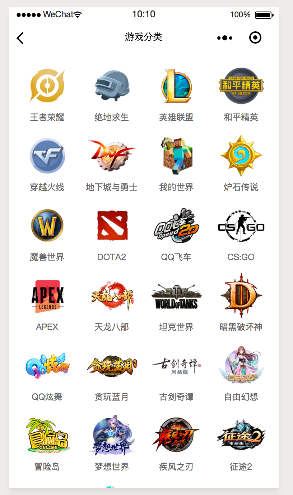
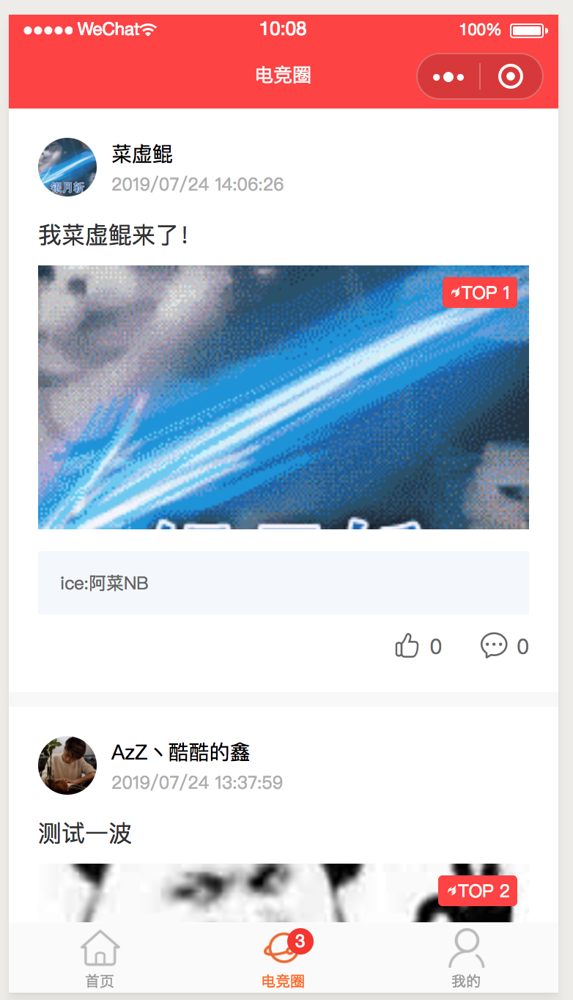
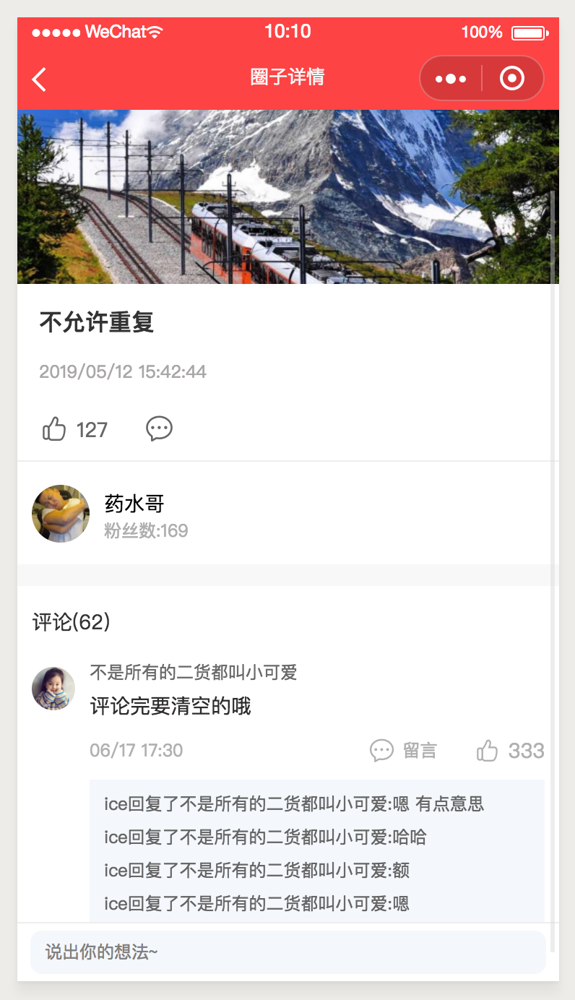
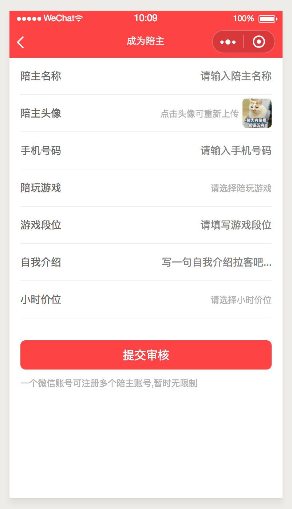
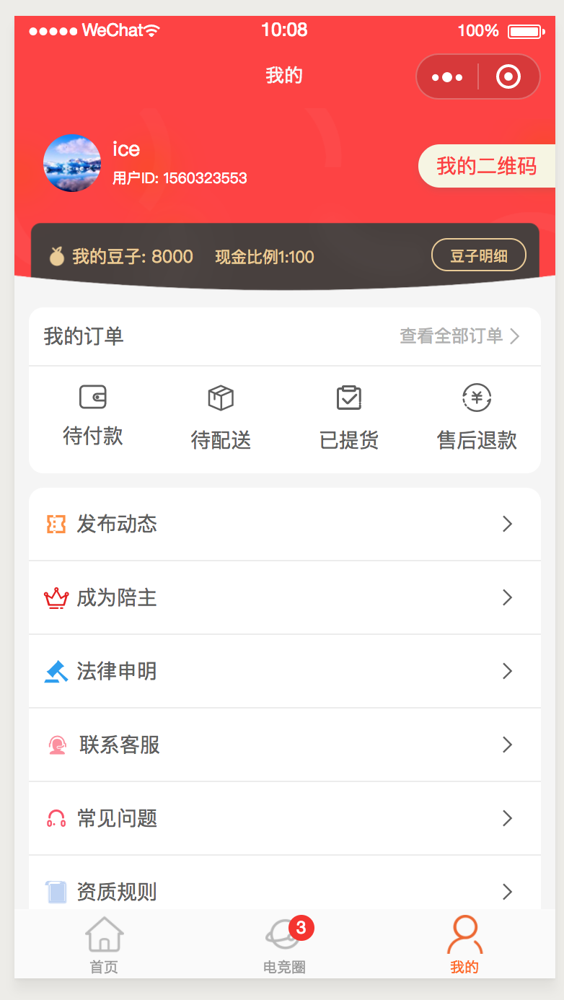
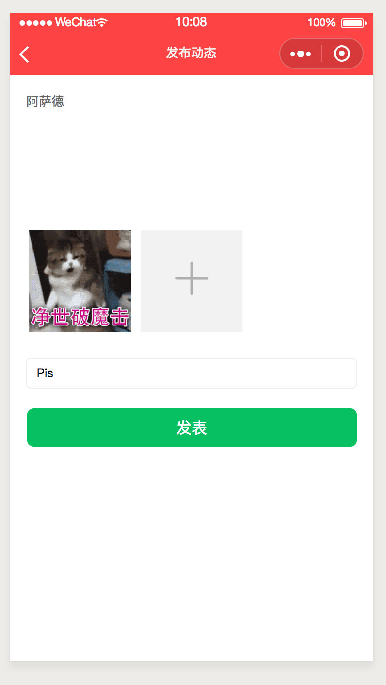
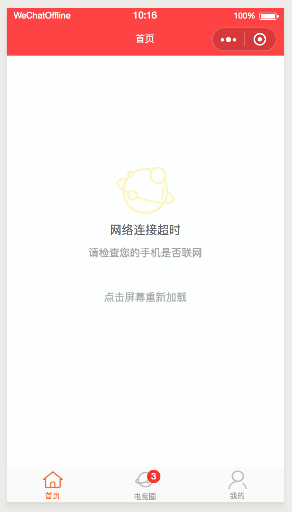

# taro 陪玩小程序

taro小程序 app

react taro redux

比较新的taro项目  适配了weapp h5  h5端部分功能没做适配(upload getImageInfo share等) 其他端暂无

## 实现功能

1、首页 swiper 热门分类 热门陪玩推荐

2、分享 canvas画海报图

3、游戏分类

4、电竞圈  帖子列表 帖子详情  发帖 回复 

5、成为陪主 、注册陪玩

6、个人中心

7、发表动态  发帖

8、小程序端 无网络状态

